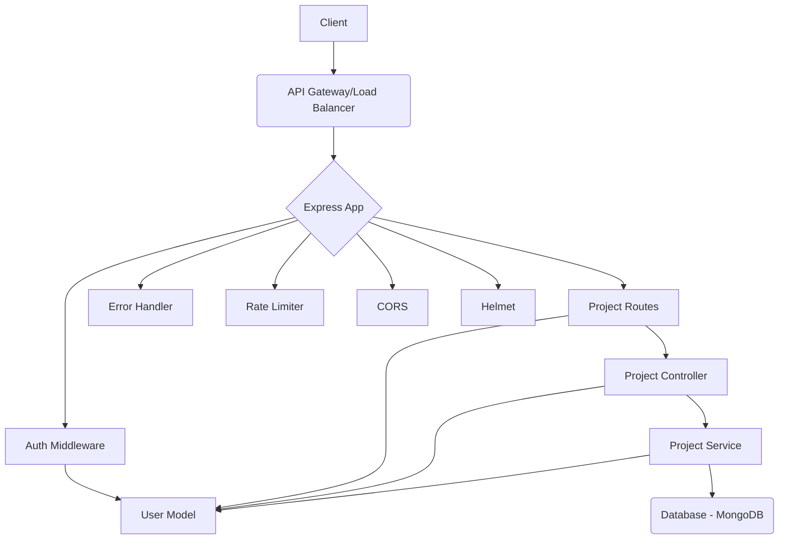

# Software Project Backend

This is the backend for the Software Project application, built with Node.js, Express, and Mongoose.

## Architecture

## API Endpoints

| Method | Path | Description | Access | Auth | Roles | 
|---|---|---|---|---|---|
| GET | / | Health check | Public | No | N/A |
| POST | /api/auth/register | Register a new user | Public | No | N/A |
| POST | /api/auth/login | Login user and get token | Public | No | N/A |
| POST | /api/projects | Create a new project | Private | Yes | Admin |
| GET | /api/projects | Get all projects | Private | Yes | User |
| GET | /api/projects/:id | Get a specific project by ID | Private | Yes | User |
| PUT | /api/projects/:id | Update a project by ID | Private | Yes | Admin |
| DELETE | /api/projects/:id | Delete a project by ID | Private | Yes | Admin |
